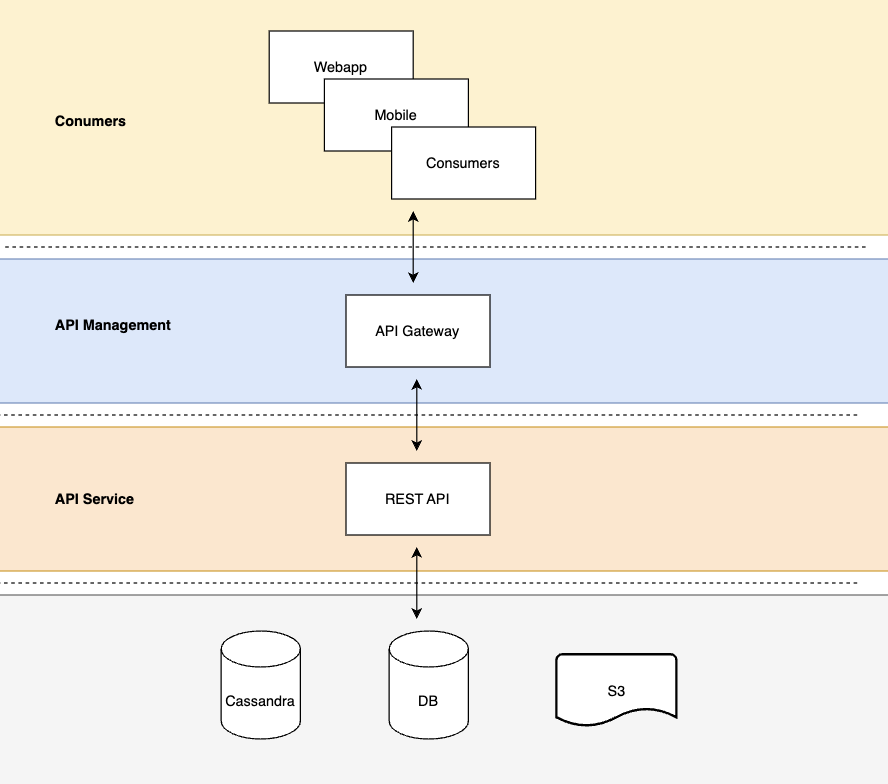

# Data as a Service using ScyllaDB

In today's data-driven world, efficient data management and accessibility are paramount. Data as a Service (DaaS) and the integration of an API Gateway play pivotal roles in enabling seamless data sharing, secure access, and efficient management. We will explore the implementation of DaaS using ScyllaDB and the advantages of incorporating an API Gateway for managing interactions.

DaaS serves as a solution to selectively and securely share data across diverse platforms and systems.

## Why DaaS can help?
Data in silos can limit its potential value across an organization. However, exposing an entire database to various teams can pose governance and security challenges. DaaS resolves this by selectively exposing valuable data via APIs, enabling secure sharing while implementing essential access controls.

## Benefits of Using DaaS
- **Agility and easy maintainability:** Rapid access to data without having knowledge of its storage and reduced maintenance overhead for data consumers.
- **Enhanced Security:** Robust authentication and authorization protocols.
- **Scalability and Load Balancing:** Efficient resource utilization and high availability.
- **Protocol Abstraction and Versioning:** Seamless integration without disruptions.
- **Monitoring and Analytics:** Insights for performance optimization and issue resolution.
- **Compliance and Governance:** Consistent application of regulatory requirements.

## Example using ScyllaDB
Using API Gateway for managing the access to ScyllaDB has advantages as you can see above.

- API Gateway for API management.
- ScyllaDB for data storage.
- RESTful Spring Boot application for API development.

